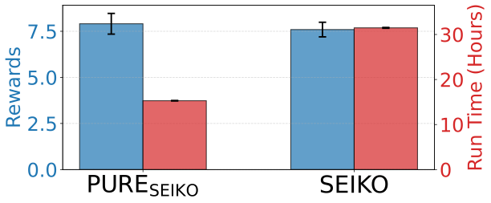
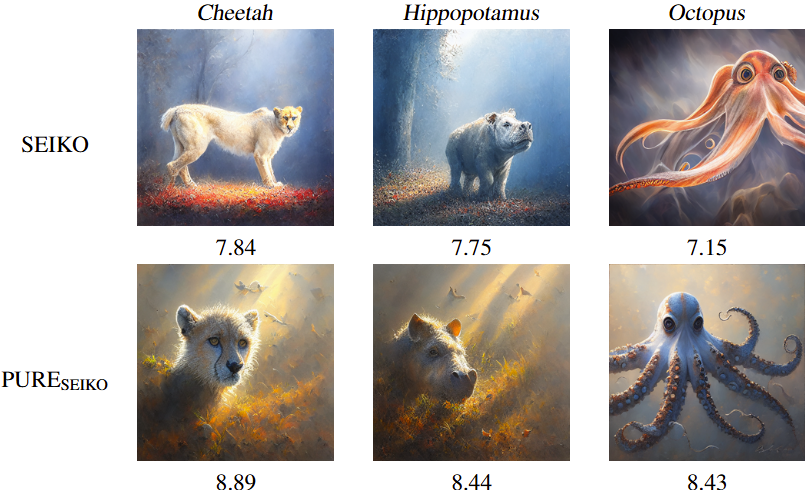
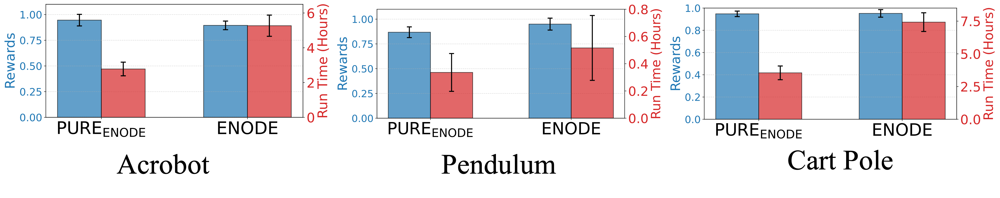

<!-- <div align="center"> -->

<!-- TITLE -->
# **Sample and Computationally Efficient Continuous-Time Reinforcement Learning with General Function Approximation**  

This is the official implementation of the paper [Sample and Computationally Efficient Continuous-Time Reinforcement Learning with General Function Approximation](https://arxiv.org/abs/2505.14821), accepted by UAI 2025.

## Overview

This repository introduces **PURE** (**P**olicy **U**pdate and **R**olling-out **E**fficient CTRL), a novel continuous-time reinforcement learning (CTRL) framework that achieves competitive performance with significantly fewer policy updates and rollouts. Our approach is supported by both theoretical guarantees and empirical evidence. The codebase includes implementations for diffusion model fine-tuning and continuous control tasks.

## Abstract

Continuous-time reinforcement learning (CTRL) provides a principled framework for sequential decision-making in environments where interactions evolve continuously over time. Despite its empirical success, the theoretical understanding of CTRL remains limited, especially in settings with general function approximation. In this work, we propose a model-based CTRL algorithm that achieves both sample and computational efficiency. Our approach leverages optimism-based confidence sets to establish the first sample complexity guarantee for CTRL with general function approximation, showing that a near-optimal policy can be learned with a suboptimality gap of $\tilde{O}(\sqrt{d_{\mathcal{R}} + d_{\mathcal{F}}}N^{-1/2})$ using $N$ measurements, where $d_{\mathcal{R}}$ and $d_{\mathcal{F}}$ denote the distributional Eluder dimensions of the reward and dynamic functions, respectively, capturing the complexity of general function approximation in reinforcement learning. Moreover, we introduce structured policy updates and an alternative measurement strategy that significantly reduce the number of policy updates and rollouts while maintaining competitive sample efficiency. We implemented experiments to backup our proposed algorithms  on continuous control tasks and diffusion model fine-tuning, demonstrating comparable performance with significantly fewer policy updates and rollouts.

## Code for $\text{PURE}_\text{SEIKO}$

### Installation

Create a conda environment with the following command:

```bash
cd PURE_SEIKO
conda create -n SEIKO python=3.10
conda activate SEIKO
pip install -r requirements.txt
```
Please use accelerate==0.17.0; other library dependencies might be flexible.

### Running
```bash
CUDA_VISIBLE_DEVICES=0 accelerate launch --num_processes=1 online/online_main_pure.py --config config/UCB.py:aesthetic --seed=31 --num_outer_loop=4
```
You can modify the --seed and --num_outer_loop values as needed.

### Reproducing SEIKO Baseline

```bash
CUDA_VISIBLE_DEVICES=0 accelerate launch --num_processes=1 online/online_main.py --config config/UCB.py:aesthetic
```

### Evaluation

We compare the running time and aesthetic reward score of $\text{PURE}\text{SEIKO}$ against $\text{SEIKO}$. As shown below, $\text{PURE}\text{SEIKO}$ achieves comparable performance with substantially reduced fine-tuning time. All experiments were conducted on a single A6000 GPU with 5 random seeds.


#### Qualitative Examples

We also visualize generated images and their aesthetic scores from $\text{PURE}_\text{SEIKO}$ and $\text{SEIKO}$.


## Code for $\text{PURE}_\text{ENODE}$

### Installation

<!-- Create a conda environment with the following command:

```bash
cd PURE_SEIKO
conda create -n SEIKO python=3.10
conda activate SEIKO
pip install -r requirements.txt
```
Please use accelerate==0.17.0; other library dependencies might be flexible. -->

### Running
<!-- ```bash
CUDA_VISIBLE_DEVICES=0 accelerate launch --num_processes=1 online/online_main_pure.py --config config/UCB.py:aesthetic --seed=31 --num_outer_loop=4
```
here the seed and number of outer loops can be adjusted via command line. -->

### Reproducing SEIKO Result (Baseline)

<!-- ```bash
CUDA_VISIBLE_DEVICES=0 accelerate launch --num_processes=1 online/online_main.py --config config/UCB.py:aesthetic
``` -->

### Evaluation

We compare the performance of $\text{PURE}\text{ENODE}$ and $\text{ENODE}$. As shown below, $\text{PURE}_\text{ENODE}$ achieves similar reward scores with significantly reduced fine-tuning time. Experiments were run on a single A6000 GPU with 20 seeds.


## Code for $\text{ENODE}_\text{SEIKO}$

### Acknowledgement

This codebase builds on top of [SEIKO](https://github.com/zhaoyl18/SEIKO) and [ODERL](https://github.com/cagatayyildiz/oderl).  We thank the original authors for making their code available.

## Citation

If you find our work useful, please consider citing:

```bibtex
@article{zhao2025sample,
  title={Sample and Computationally Efficient Continuous-Time Reinforcement Learning with General Function Approximation},
  author={Zhao, Runze and Yu, Yue and Zhu, Adams Yiyue and Yang, Chen and Zhou, Dongruo},
  journal={arXiv preprint arXiv:2505.14821},
  year={2025}
}
```
